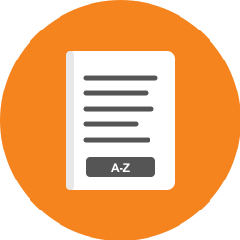
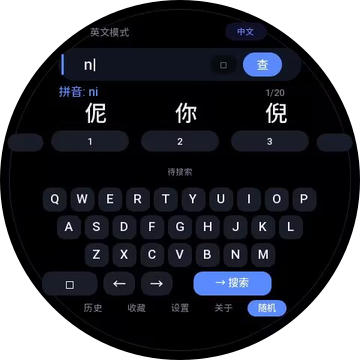
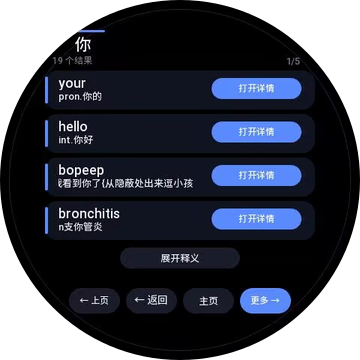
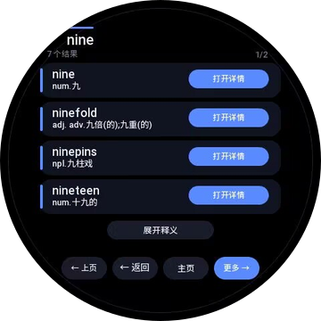
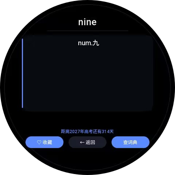

<p align="center">
  
</p>

# Ring Dictionary

An offline English-Chinese dictionary for Amazfit Zepp OS round-screen watches. It provides QWERTY input, Pinyin input, fast local search, history, and favorites.

[Chinese README](./README.md) · [Privacy Statement](./PRIVACY.md)

> **Current release:** `v2.1.0` · App ID: `1121555` · version code: `6` · Supports Zepp OS 3.0 and later.

## Features

### English and Chinese lookup

- Exact, prefix, and limited fuzzy English search.
- Chinese definition lookup. For example, searching for `你` can find entries such as `your` and `hello`.
- The dictionary runs entirely offline. No account, network connection, advertising, or cloud API is required.
- Result cards show definition previews. Missing definitions are resolved only after opening a detail page or expanding definitions, keeping search responsive.
- Pagination and bounded caches prevent full-dictionary preloading, excessive synchronous reads, and memory spikes.

### QWERTY and Pinyin input

- A fixed QWERTY keyboard supports English words and Pinyin.
- Chinese mode provides character candidates, candidate paging, backspace, and clear actions.
- English mode provides left and right cursor controls, backspace, and direct search.
- Crown-free watches can use visible touch controls for candidate paging and result navigation.

### Details, history, and favorites

- Detail pages display the word, definition, favorite state, and related terms.
- Long definitions have touch controls for previous and next sections. Balance, Active 2 Round, and GTR 4 also support digital-crown shortcuts.
- Search results, history, and favorites all provide touch paging.
- Returning from a detail page restores the original result page without relying on shared JavaScript global state.

### Gaokao countdown and local settings

- The watch settings page can enable a Gaokao countdown.
- The home page shows a daily countdown toast once per day.
- The detail page displays the current countdown.
- Dark and light themes, autocomplete, and debug information can be configured locally.
- The phone-side settings page provides guidance only. It does not expose toggles that cannot synchronize to the watch.

## Screenshots

All screenshots meet the Zepp OS Console app-preview requirement: `360 x 360` PNG with an RGBA transparent background.

<table>
  <tr>
    <td width="50%" align="center">
      <br>
      <sub><b>Home</b><br>English and Chinese modes, Pinyin candidates, and QWERTY input</sub>
    </td>
    <td width="50%" align="center">
      <br>
      <sub><b>Chinese results</b><br>Chinese definition search, definition previews, and paging</sub>
    </td>
  </tr>
  <tr>
    <td width="50%" align="center">
      <br>
      <sub><b>Word details</b><br>Definition card, favorites, return, and dictionary lookup</sub>
    </td>
    <td width="50%" align="center">
      <br>
      <sub><b>English results</b><br>English lookup, definition previews, and paging</sub>
    </td>
  </tr>
</table>

## Supported devices

`app.json` currently declares these round-screen Amazfit device targets:

| Series | Device targets | Screen target | Navigation |
| --- | ---: | ---: | --- |
| Amazfit Balance | 3 | 480 x 480 | Crown / touch |
| Amazfit Cheetah Pro | 2 | 480 x 480 | Touch |
| Amazfit Active 2 (Round) | 8 | 466 x 466 | Crown / touch |
| Amazfit GTR 4 / GTR 4 LE | 3 | 466 x 466 | Crown / touch |
| Amazfit T-Rex 3 | 3 | 480 x 480 | Touch |

> **Note**
> The digital crown is a convenience, never a functional dependency. Cheetah Pro and T-Rex 3 can complete candidate, result, history, favorite, and definition navigation with touch controls.
>
> This release declares round-screen targets only. Square Amazfit Active, Square Active 2, and the 360 x 360 Active Edge require an independent layout and are intentionally outside this release scope.

## How to use

### Look up an English word

1. Open the app to the home page.
2. Tap letters on the QWERTY keyboard.
3. Select the search control.
4. Open a result to view its full definition.

### Look up a Chinese definition

1. Switch to Chinese mode on the home page.
2. Enter Pinyin using the QWERTY keyboard.
3. Tap a numbered candidate to add a Chinese character.
4. Use the visible paging controls when there are more candidates. Watches with a crown can also use it as a shortcut.
5. Start the search when the query is complete.

### View details, return, and favorite words

1. Open a result from the results page.
2. Select Favorite on the detail page to save the word.
3. Select Back to return to the original results page.
4. Use the home page navigation to open history, favorites, settings, about, or a random lookup.

## Privacy and data

- Search queries, history, favorites, and settings are stored on the watch by default.
- Dictionary lookups run locally and never upload search content.
- The app does not require an account and does not use advertising, analytics, location, contacts, microphone, photos, or payment services.
- Read the complete statement in [PRIVACY.md](./PRIVACY.md). Its content must also be entered in the Zepp Developer Center before store submission.

## Development and build

### Prerequisites

- Node.js (a current LTS release is recommended)
- Zepp OS development environment
- Access to an npm registry

### Install dependencies

```bash
npm ci
```

### Build the installation package

```bash
npm run build
```

Or run Zeus directly:

```bash
npx zeus build
npx zeus prune --ip
```

Build outputs are written to `dist/`. The `.zab` package can be installed through Zepp App developer mode or compatible installation tools.

### Preview

```bash
npm run preview
```

You can also select a target device name through the Zeus CLI.

## Project structure

```text
app.js                    # Watch entry point and physical back-key handling
app.json                  # App ID, permissions, pages, device targets, and i18n
page/home.js              # Home page, QWERTY, Pinyin input, and search
page/results.js           # Results, pagination, definition expansion, and routing
page/detail.js            # Details, definition scrolling, favorites, and return
page/history.js           # History and pagination
page/favorites.js         # Favorites and pagination
page/settings.js          # Watch settings
page/about.js             # About page and GitHub QR code
setting/index.js          # Zepp App settings information page
utils/dict-engine.js      # Windowed reads, indexed search, and Chinese inverted lookup
utils/route-cache.js      # Temporary cross-page result cache
utils/crown.js            # Shared digital-crown support
utils/storage.js          # Watch-local storage
utils/pinyin.js           # Pinyin candidate dictionary
page/i18n/                # Watch Chinese and English PO resources
setting/i18n/             # Phone settings Chinese and English PO resources
assets/common/dic/        # Dictionary files and indexes
assets/common/icon.png    # 240 x 240 RGBA store icon
assets/common/github_qr_ring.png # GitHub QR code
docs/images/              # 360 x 360 Console and README screenshots
```

## Verification

```bash
node tools/verify-search.mjs
node tools/test-publish-features.mjs
node tools/test-results-preview-style.mjs
node tools/test-i18n-keys.mjs
node tools/test-release-consistency.mjs
node --loader ./tools/loader.mjs tools/test-detail-navigation-regression.mjs
node --loader ./tools/loader.mjs tools/test-word-family-search.mjs
node --loader ./tools/loader.mjs tools/test-cn-read-budget.mjs
npx zeus build
npx zeus prune --ip
```

See [RELEASE-VALIDATION.md](./RELEASE-VALIDATION.md) for the latest package validation record.

## License

This project is released under the [MIT License](./LICENSE). You may use, modify, distribute, or use it commercially while retaining the copyright and license notice.
